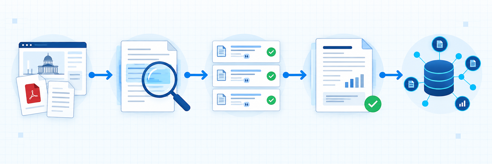

# Evidence Report



**Evidence Report는 공식자료 조사부터 페이지 단위 검증, DOCX 작성, 전체 페이지 검사까지 한 번에 끝내는 AI 에이전트 스킬입니다.**

Codex와 Claude Code에서 같은 작업 절차를 사용할 수 있도록 공용 `SKILL.md`, 검증 기준, 완료 검사 스크립트로 구성했습니다.

## 왜 만들었나요

복잡한 조사 업무에서는 사용자가 다음 단계를 계속 지시하게 되는 문제가 있습니다.

```text
공식 홈페이지에서 찾아봐
→ 첨부 PDF도 확인해
→ 정확한 페이지를 제시해
→ 부족한 근거를 보완해
→ DOCX로 만들어
→ 문서가 깨지지 않았는지 확인해
→ 파일을 열고 지식창고에 저장해
```

Evidence Report는 이 과정을 하나의 완료 조건으로 묶습니다. 중간 검색 결과나 초안을 최종 결과라고 보고하지 않습니다.

## 처리 흐름

```text
공식 원문 탐색
→ 공고문·지침·Q&A 다운로드
→ 페이지·조항 단위 근거 추출
→ 핵심 주장 교차검증
→ 사실·해석·미확인 사항 분리
→ 최종 보고서 작성
→ DOCX 전체 페이지 렌더링 검사
→ 파일 전달 및 선택적 지식 저장
```

## 방지하는 오류

- 검색 결과의 요약문만 보고 조사를 끝내는 일
- 사업 전체 예산을 과제당 지원한도로 잘못 해석하는 일
- 금지조항이 없다는 이유로 참여가 보장된다고 판단하는 일
- PDF를 실제로 열지 않고 출처로 제시하는 일
- 확인된 사실과 추정·해석을 섞는 일
- DOCX 전체 페이지를 확인하지 않고 전달하는 일
- 보관·수집 작업이 남았는데 완료했다고 보고하는 일

## 설치

```bash
git clone https://github.com/iscream2124/evidence-report.git
cd evidence-report
./install.sh
```

설치 위치:

- Codex: `~/.agents/skills/evidence-report`
- Claude Code 호환 Agent Skills: `~/.claude/skills/evidence-report`

기존에 같은 이름의 스킬이 있으면 덮어쓰지 않고 건너뜁니다.

## 사용법

### Codex에서 명시적으로 실행

```text
$evidence-report 중견기업이 조리로봇 실증사업에 참여할 수 있는지 조사해라.
공식 근거 확보부터 최종 DOCX와 전체 페이지 검수까지 끝내라.
```

### 자연어로 실행

```text
이 사안을 공식 1차 자료로 조사하고 페이지별 근거가 포함된
최종 검증보고서를 DOCX로 완성해줘.
```

### 위키 수집까지 요청

```text
$evidence-report 공식 근거부터 DOCX 검증까지 완료하고
최종 결과를 Obsidian 위키에도 ingest해줘.
```

## 완료 검사

`examples/run-state.example.json`을 복사해 실행 상태를 기록한 후 다음 명령을 실행합니다.

```bash
python3 skills/evidence-report/scripts/check_completion.py run-state.json
```

모든 적용 항목이 완료되면 `COMPLETE`를 출력합니다. 하나라도 빠지면 종료코드 `1`과 함께 다음처럼 미완료 항목을 표시합니다.

```text
INCOMPLETE: page_level_evidence_recorded, all_docx_pages_rendered_and_checked
```

## 완료 기준

- 공식 1차 자료를 확보했거나 확보 불가능 사유를 기록했는가
- 핵심 주장마다 문서명·페이지·조항 또는 질문번호가 있는가
- 결정적인 표와 조건을 실제 페이지 화면으로 확인했는가
- 사실·해석·미확인 사항을 분리했는가
- 금액·비율·기간의 기준과 범위를 교차검증했는가
- 요청된 최종 파일을 생성했는가
- DOCX가 필요한 경우 모든 페이지를 렌더링해 검사했는가
- 최종 파일이 실제 경로에 존재하고 열리는가
- 요청된 ingest 또는 보관 작업을 완료했는가

## 폴더 구조

```text
evidence-report/
├── .codex-plugin/plugin.json
├── assets/evidence-report-flow.png
├── examples/run-state.example.json
├── skills/evidence-report/
│   ├── SKILL.md
│   ├── agents/openai.yaml
│   ├── references/
│   │   ├── completion-gates.md
│   │   └── source-policy.md
│   └── scripts/check_completion.py
├── install.sh
└── LICENSE
```

## 근거 등급

1. 공고·법령·판결·표준·원본 데이터의 발행기관
2. 정부 공식 미러 또는 기록보관소
3. 실제 집행 책임기관
4. 신뢰할 수 있는 2차 자료
5. 공고 집계사이트·업체 요약·커뮤니티 자료

하위 자료는 공식자료를 찾거나 보조 검증할 때 사용하고, 확보 가능한 공식 원문을 대신하지 않습니다.

## 현재 범위와 다음 단계

현재 공개판은 별도 서버나 API 키 없이 사용하는 Agent Skill 버전입니다. 각 에이전트가 보유한 웹·파일·PDF·문서 도구를 이용합니다.

향후 PDF 다운로드·페이지 인용 MCP 서버, DOCX 공용 실행기, 한국 정부기관 사이트 어댑터, 실행 현황 UI를 추가할 수 있습니다.

## 기여

오류 사례, 새로운 공식자료 사이트, 문서 템플릿, 완료 기준 개선안은 Issue 또는 Pull Request로 공유해 주세요.

## 라이선스

Apache-2.0
